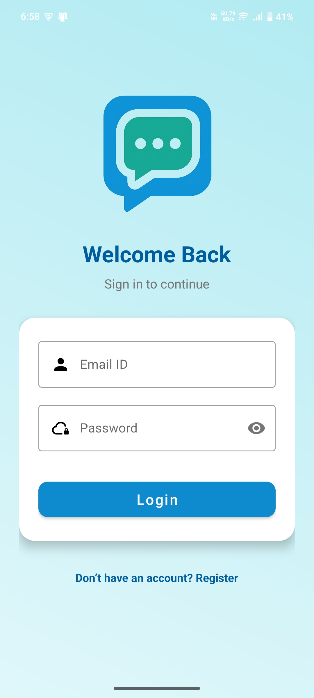
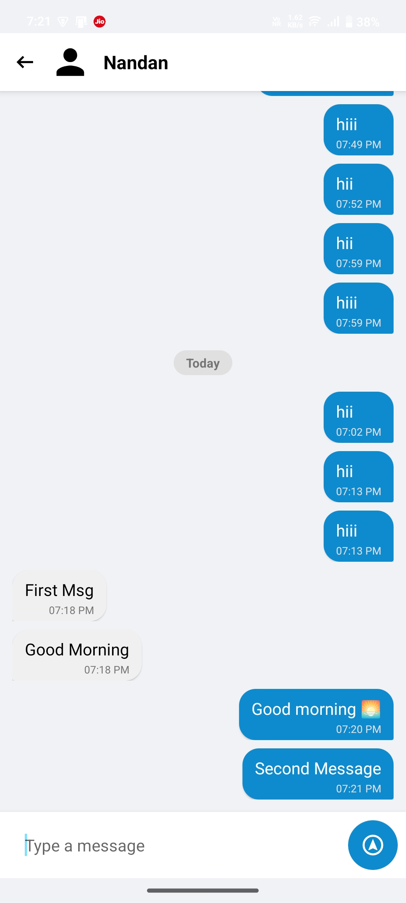
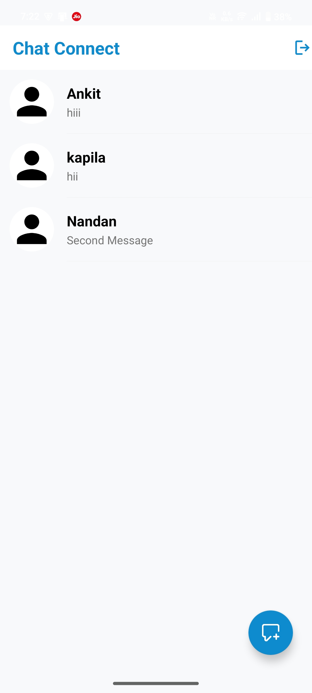

# 💬 Chat Connect

Chat Connect is a real-time Android messaging application built using **Kotlin** and **XML**, powered by **Firebase** for authentication and live data synchronization.

This project demonstrates real-time communication, backend integration, and structured Android development practices.

---

## 🚀 Features

- 🔐 Firebase Authentication (Login & Signup)
- 💬 Real-time one-to-one messaging
- 🔄 Instant message synchronization
- 🔔 In-app notifications
- 🧭 Clean and responsive UI
- 📱 Optimized for modern Android devices

---

## 🛠 Tech Stack

- **Language:** Kotlin  
- **UI:** XML Layouts  
- **Backend:** Firebase  
  - Firebase Authentication  
  - Firebase Realtime Database / Firestore  
- **Architecture:** Structured Android project architecture  

---

## 📸 Screenshots


<p align="center">
  
  
  
</p>


---

## 🧩 Project Structure
```txt
Chat-Connect/
│
├── app/
│ ├── activities/
│ ├── adapters/
│ ├── models/
│ ├── utils/
│ └── firebase/
│
└── res/
├── layout/
├── drawable/
└── values/

```

---

## ⚙️ Setup Instructions

1. Clone the repository:
   https://github.com/Nandan1128/Chat_Connect.git
2. Open in Android Studio
3. Connect your own Firebase project:
   - Create project in Firebase Console
   - Enable Authentication
   -Enable Realtime Database / Firestore
   -Replace google-services.json
4. Sync Gradle and run the app

📦 Release
Download the latest APK from the Releases section.

🎯 Purpose of This Project

This project was built to:
Strengthen understanding of real-time databases
Implement Firebase authentication securely
Practice scalable Android app architecture
Demonstrate end-to-end mobile application development

📌 Future Improvements

Group chat functionality
Media (image/file) sharing
Online/offline presence status
Dark mode support
Push notifications via FCM

👨‍💻 Developer

Developed by Nandan Gogari
Android & AI Developer

⭐ If you found this project useful
Consider giving it a star ⭐
